# Report of Reinforcement Learning for 2048 Game

## Team Members

| Name | Student ID | Contribution | Completion |
| --- | --- | --- | --- |
| Dang Anh Tien | 25C11022 | Implemented QR-DQN and H-DQN notebooks. Conducted experiments and analyzed results. | 100% |
| Dinh Hoang Duong | 25C11034 | Implemented DQN, Double DQN, and Dueling DQN notebooks. Conducted experiments and analyzed results. | 100% |
| Duong Tan Phat | 25C11057 | Explored hyperparameter tuning for models. Surveyed their performance with different numbers of episodes. | 100% |

## Overview

This project implements and evaluates five different Deep Reinforcement Learning algorithms to play the game of 2048. Specifically, we developed and compared Deep Q-Network (DQN), Double DQN (DDQN), Dueling Double DQN (DDDQN), Quantile Regression DQN (QR-DQN), and Hierarchical DQN (H-DQN). Our goal is to explore how algorithmic improvements to the base DQN architecture affect the learning efficiency, maximum tile achieved, and overall game score in the 2048 environment.

The project encompasses a full pipeline including environment integration based on OpenSpiel, model implementation in PyTorch, hyperparameter optimization utilizing Optuna, and empirical evaluation over a varying number of training episodes.

## Implementation

### DQN
The Deep Q-Network (DQN) serves as our baseline. As introduced by teacher's example notebook, DQN stabilizes the training of action-value functions using a neural network by employing a target network and an experience replay buffer. In our scenario, the state comprises the 4x4 grid of the 2048 board, and the model outputs the Q-values for the four possible sliding directions.

Below is an illustration of our basic `QNetwork` architecture:

```python
class QNetwork(nn.Module):
    def __init__(self, obs_dim, num_actions, hidden_dim=256):
        super().__init__()
        self.net = nn.Sequential(
            nn.Linear(obs_dim, hidden_dim),
            nn.ReLU(),
            nn.Linear(hidden_dim, hidden_dim),
            nn.ReLU(),
            nn.Linear(hidden_dim, num_actions),
        )

    def forward(self, x):
        return self.net(x)
```

### Double DQN
Standard DQN frequently overestimates action values because it uses the same network to both select and evaluate an action during the target computation. To address this, we implemented Double DQN (Van Hasselt et al., 2016). This method decouples action selection from action evaluation by selecting the best action using the online network but evaluating its value using the target network, leading to less biased Q-value estimates.

The core decoupling in our `double_dqn_update` (from `app/helpers.py`) acts dynamically to avoid compounding positive estimation errors:
```python
with torch.no_grad():
    # Action selection using the online network
    next_online_q = q_net(next_obs)
    next_online_q = next_online_q.masked_fill(~next_legal_mask, -1e9)
    next_actions = torch.argmax(next_online_q, dim=1, keepdim=True)

    # Action evaluation using the target network
    next_target_q = target_net(next_obs).gather(1, next_actions).squeeze(1)
    next_target_q = torch.where(dones > 0.5, torch.zeros_like(next_target_q), next_target_q)
    target = rewards + gamma * next_target_q
```

### Dueling Double DQN
Building on Double DQN, we incorporated the Dueling Network Architecture (Wang et al., 2016). This model separates the representation of the state value and the state-dependent action advantages into two separate streams that merge at the output layer. This architectural change allows the agent to better evaluate states independent of the actions, which is highly beneficial in 2048 where some states are inherently poor regardless of the chosen move.

Here is the implementation of `DuelingQNetwork` (from `app/dueling_q_network.py`):
```python
class DuelingQNetwork(nn.Module):
    def __init__(self, obs_dim, num_actions, hidden_dim=256):
        super().__init__()
        self.shared_net = nn.Sequential(
            nn.Linear(obs_dim, hidden_dim),
            nn.ReLU(),
            nn.Linear(hidden_dim, hidden_dim),
            nn.ReLU(),
        )
        self.value_head = nn.Linear(hidden_dim, 1)
        self.advantage_head = nn.Linear(hidden_dim, num_actions)

    def forward(self, x):
        shared = self.shared_net(x)
        value = self.value_head(shared)
        advantage = self.advantage_head(shared)
        
        # Combine: Q(s,a) = V(s) + (A(s,a) - mean(A(s,:)))
        q_values = value + (advantage - advantage.mean(dim=1, keepdim=True))
        return q_values
```

### QR-DQN
To capture the full distribution of rewards rather than just the expected value, we implemented Distributional Reinforcement Learning with Quantile Regression (QR-DQN) (Dabney et al., 2018). QR-DQN predicts a set of quantiles for the return distribution. This approach often leads to much more robust learning and provides the agent with a richer signal from the environment, which is evident in its superior performance in our evaluation.

Unlike computing a single scalar action-value, `QuantileQNetwork` estimates a multi-dimensional tensor evaluating cumulative quantiles (from `app/qr_q_network.py` and `app/qr_dqn.py`):
```python
class QuantileQNetwork(nn.Module):
    def __init__(self, obs_dim: int, num_actions: int, num_quantiles: int = 51, hidden_dim: int = 256):
        # ...
        self.net = nn.Sequential(
            nn.Linear(obs_dim, hidden_dim),
            nn.ReLU(),
            # ...
            nn.Linear(hidden_dim, num_actions * num_quantiles), # Outputs distribution of returns
        )

    def forward(self, x: torch.Tensor) -> torch.Tensor:
        out = self.net(x)
        return out.view(-1, self.num_actions, self.num_quantiles) # [batch, num_actions, num_quantiles]

def quantile_huber_loss(pred_quantiles, target_quantiles, taus, kappa):
    """Compute QR-DQN quantile Huber loss over [batch, num_quantiles] target distributions."""
    td_error = target_quantiles.unsqueeze(1) - pred_quantiles.unsqueeze(2)
    # Applies asymmetric quantile weighting and integrates bounded huber calculations ...
```

### H-DQN
Inspired by Integrating Temporal Abstraction and Intrinsic Motivation (Kulkarni et al., 2016), we explored a Hierarchical DQN (H-DQN) approach. The agent operates at two levels of temporal abstraction: a meta-controller that sets high-level goals (e.g., reaching specific tile configurations) and a controller that executes primitive actions to achieve those goals. 

In code (from `app/h_dqn.py`), goals are selected sequentially and explicitly appended into the controller’s target observation. The meta-goal is a tile feature extracted logically via log transformation (`normalize_goal`):

```python
@torch.no_grad()
def select_meta_goal(meta_net: QNetwork, obs, goals, epsilon, device):
    # Meta controller generates a discrete goal index, e.g., aiming for tile '256'
    obs_t = torch.tensor(np.asarray([obs]), dtype=torch.float32, device=device)
    q_goals = meta_net(obs_t).squeeze(0)
    return int(torch.argmax(q_goals).item())

@torch.no_grad()
def select_controller_action(controller_net: QNetwork, obs, goal_tile, legal_actions_list, ...):
    # Action selection uses state concatenated with log-normalized goals
    obs_aug = augment_obs_with_goal(obs, goal_tile) # State: [4x4 board, 1x1 goal]
    obs_t = torch.tensor(obs_aug, dtype=torch.float32, device=device).unsqueeze(0)
    q = controller_net(obs_t).squeeze(0)
    # ... Uses masked max-Q for primitive action
``` 

## Hyperparameter Tuning

We utilized Optuna to automatically search for optimal hyperparameters for each model. The tuning process was centralized using a configurable argument-parser and trial-suggestion mechanism (as seen in `app/optuna_tune.py`). This ensured a standardized setup for every model tuned under the same environmental constraints (such as `max_steps_per_episode` effectively limiting computational budgets). 

Our tuning setup objective was to maximize a custom score that considers both the expected return and variances constraints:
```python
def objective(trial: optuna.Trial) -> float:
    # ... training execution ...
    avg_return = float(summary["avg_return"])
    std_return = float(summary["std_return"])
    score = avg_return - cli_args.metric_penalty * std_return
    return score
```

The search space explored during these Optuna trials included:
```python
def suggest_hparams(trial: optuna.Trial) -> dict:
    return {
        "buffer_size": trial.suggest_categorical("buffer_size", [20_000, 50_000, 100_000, 200_000]),
        "batch_size": trial.suggest_categorical("batch_size", [64, 128, 256]),
        "gamma": trial.suggest_float("gamma", 0.95, 0.999),
        "lr": trial.suggest_float("lr", 1e-5, 3e-3, log=True),
        "target_sync_every": trial.suggest_categorical("target_sync_every", [100, 250, 500, 1000, 2000]),
        "learn_start": trial.suggest_categorical("learn_start", [500, 1000, 2000, 5000]),
        "learn_every": trial.suggest_categorical("learn_every", [1, 2, 4, 8]),
        "eps_end": trial.suggest_float("eps_end", 0.01, 0.2),
        "eps_decay_steps": trial.suggest_categorical("eps_decay_steps", [5000, 10000, 20000, 50000, 100000]),
        "grad_clip": trial.suggest_float("grad_clip", 1.0, 20.0),
    }
```

The best hyperparameters found across our trials are summarized below:

| Hyperparameter | DQN | Double DQN | Dueling Double DQN | QR-DQN | H-DQN |
| --- | --- | --- | --- | --- | --- |
| **Buffer Size** | 200,000 | 20,000 | 200,000 | 200,000 | 20,000 |
| **Batch Size** | 128 | 256 | 64 | 256 | 256 |
| **Gamma ($\gamma$)** | 0.956 | 0.980 | 0.965 | 0.992 | 0.997 |
| **Learning Rate (`lr`)** | 1.44e-4 | 9.77e-4 | 2.92e-3 | 1.02e-4 | 1.79e-4 |
| **Target Sync Every** | 250 | 100 | 250 | 1000 | 250 |
| **Learn Start** | 1000 | 1000 | 2000 | 5000 | 5000 |
| **Learn Every** | 8 | 2 | 8 | 2 | 8 |
| **Eps End** | 0.149 | 0.170 | 0.192 | 0.162 | 0.045 |
| **Eps Decay Steps** | 20,000 | 50,000 | 10,000 | 20,000 | 20,000 |
| **Grad Clip** | 4.31 | 6.67 | 1.12 | 15.05 | 7.01 |

During evaluation, **QR-DQN** achieved the highest score among the tuned models with an impressive Average Return of 3169.4 and an Average Max Tile of 249.6.

### Hyperparameter Importance

Below plots summarize the importance of each hyperparameter for the different models:

| DQN | Double DQN |
| :---: | :---: |
| 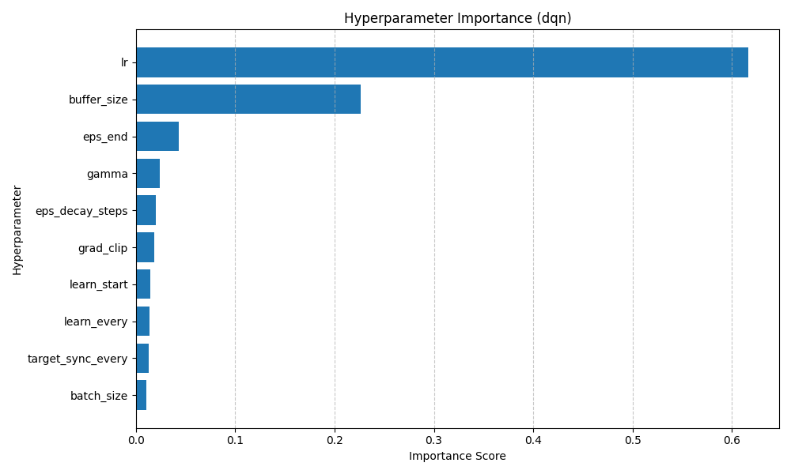 | 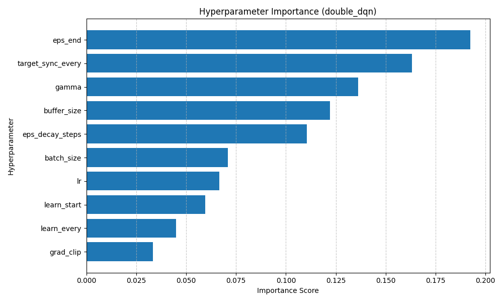 |
| **Dueling Double DQN** | **QR-DQN** |
| 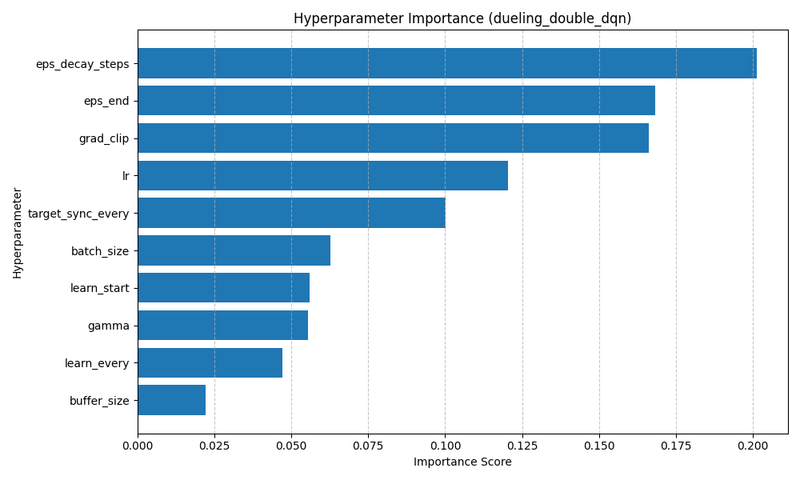 | 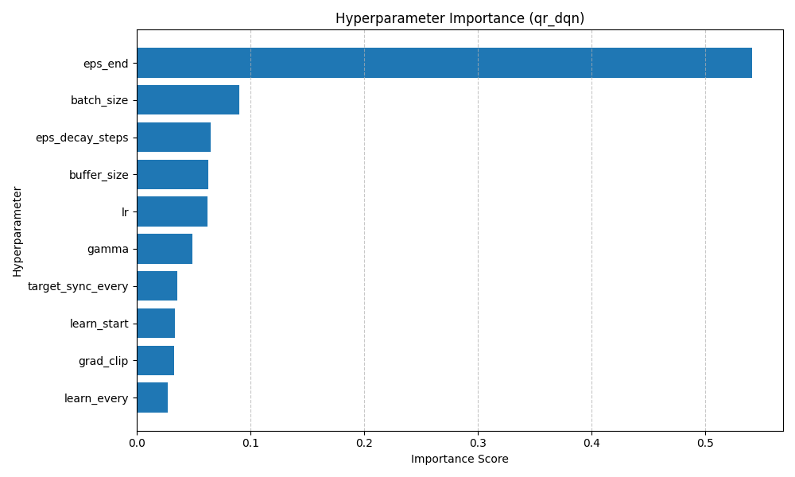 |
| **H-DQN** | |
| 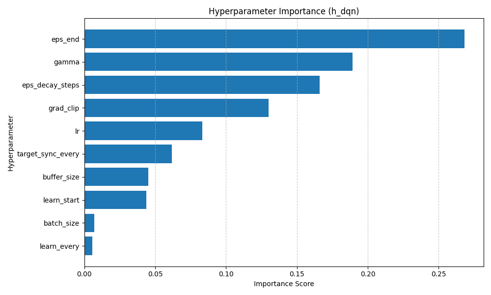 | |

- **Standard Baseline (DQN):** The standard DQN configuration exhibits massive sensitivity to the Learning Rate (`lr`: 0.569) and Experience Replay size (`buffer_size`: 0.219). Without the decoupling mechanisms introduced in later architectures, standard DQN is perilously susceptible to overestimation bias and catastrophic divergence (Mnih et al., 2015). A precisely tuned learning rate limits severe gradient oscillation, whilst a large replay buffer ensures consecutive correlated experiences do not irreparably drift the Q-values.
- **Overestimation Correction (Double DQN):** Upon mitigating the target evaluation maximization bias via Double Q-Learning (Van Hasselt et al., 2016), the algorithm stabilizes the fundamental gradient step. Consequently, the greatest influence shifts away from pure step-size constraints and moves toward temporal reward valuations (`gamma`: 0.149), replay diversity (`buffer_size`: 0.138), and exploration limits (`eps_end`: 0.121). 
- **Decoupled Advantages (Dueling DDQN) & Full Distributions (QR-DQN):** For both the highly data-efficient Dueling architecture (Wang et al., 2016) and the distributional tracker QR-DQN (Dabney et al., 2018), exploration becomes the dominant constraint. Both models drastically emphasize exploration schedules (`eps_decay_steps`: 0.197 & `eps_end`: 0.515, respectively). Because Dueling networks inherently generalize action-advantages effectively even in poor states, and QR-DQN receives exceptionally rich scalar distributions across all actions, both models require a diverse, heavily-explored state distribution to refine their complex targets correctly without settling into localized maxima.
- **Hierarchical Dependencies (H-DQN):** H-DQN heavily relies on its exploration ceiling (`eps_end`: 0.229) and discount factor (`gamma`: 0.222). The two-tier hierarchical controller (Kulkarni et al., 2016) must actively discover reachable sub-goals in the chaotic 2048 grid. If exploration cuts off too early or temporal discounting poorly aligns with the step-length of the options, the meta-controller becomes crippled, repetitively selecting unattainable grid transitions.

## Survey on Different Numbers of Episodes

To understand how training length impacts performance, we use tuned hyperparameters to evaluate each model after training for 300, 500, 1000, 2000, 3000, and 5000 episodes. And let them play 100 games to compute the output.

Below are visual summaries of model performances relative to the number of training episodes for all recorded metrics:

| Average Return | Standard Deviation of Return |
| :---: | :---: |
| 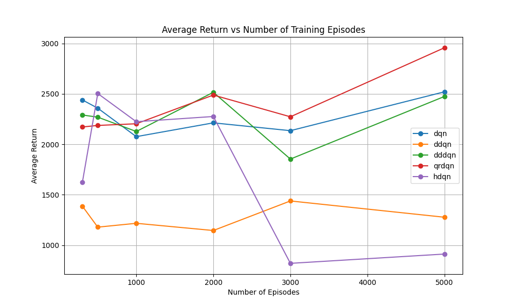 | 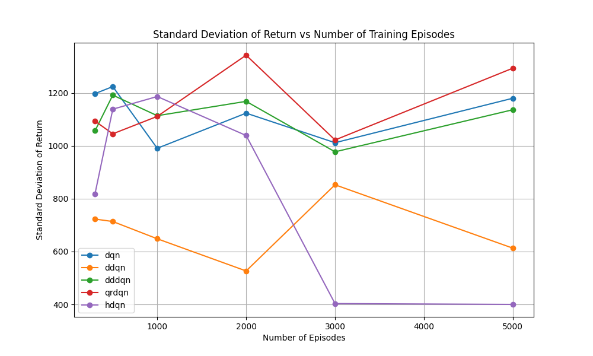 |
| **Average Game Length** | **Average Max Tile** |
| 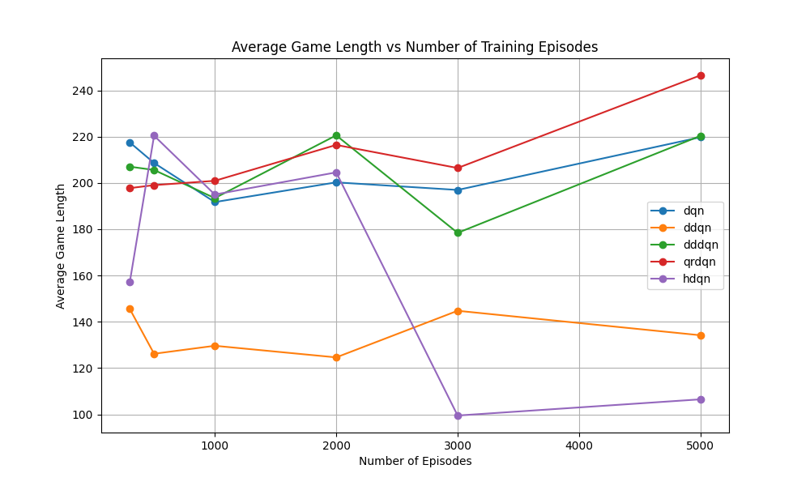 | 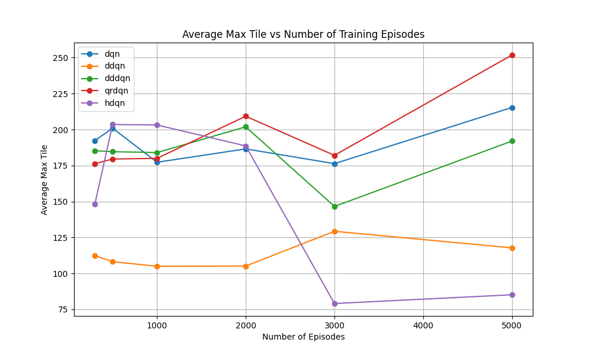 |
| **Average Illegal Action Attempts** | **Total Illegal Action Attempts** |
| 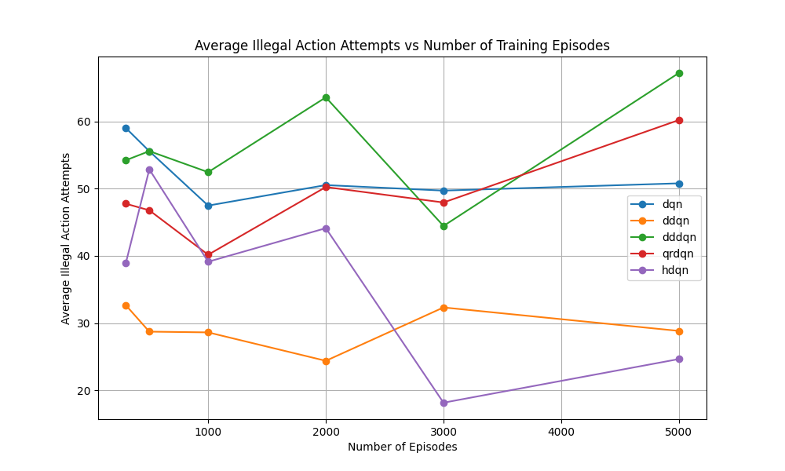 | 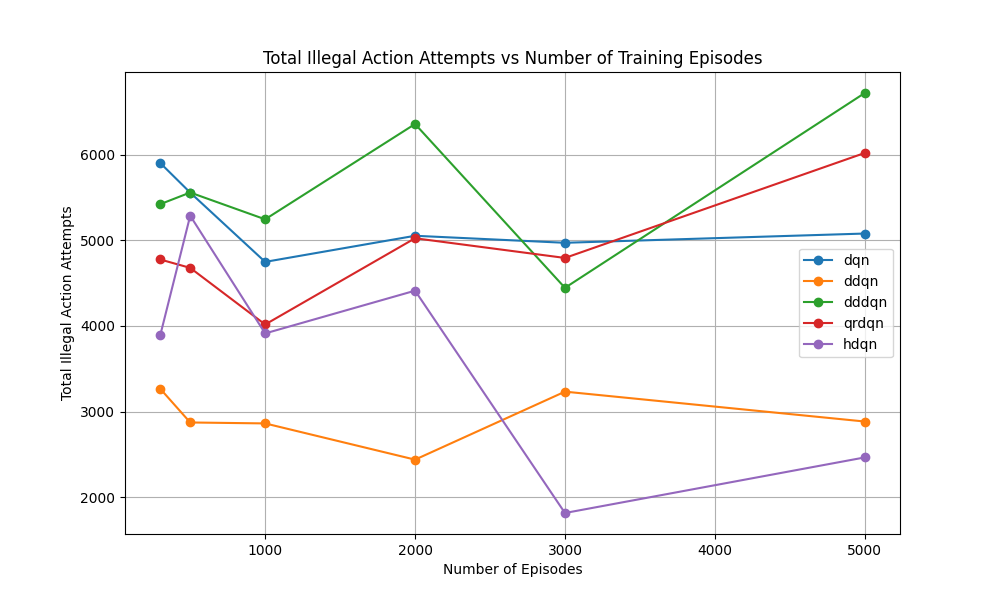 |

### Analysis of Training Progression and Stability

Based on our survey data and experiment setup, we can draw the following analytical conclusions grounded in existing literature:

1. **Distributional and Dueling Strengths (QR-DQN & DDDQN):** QR-DQN consistently improves and holds the highest ceiling (peaks at ~2950 average return by 5000 episodes). The 2048 environment inherently features severe variance: randomly spawning a 2 or 4 tile in any open position fundamentally alters future returns. As established by Dabney et al. (2018), QR-DQN captures the full discrete distribution of these anticipated returns, not just their mean. This complex signal helps the optimizer distinguish between consistently good moves and moves with extreme variance. Similarly, Dueling networks (Wang et al., 2016) efficiently decouple the value of a state from the advantage of an action. In 2048, many states are "doomed" regardless of action (low state-value); separating the streams allows faster identification of precisely which moves delay the inevitable best.
2. **Baseline Fluctuations vs. Double DQN Constraints:** Standard DQN reveals high variance and chaotic progression dips (e.g., dropping between 500 and 1000 episodes). This is heavily linked to the upwardly biased positive compounding errors found in standard formulation (Mnih et al., 2015). Conversely, Double DQN (DDQN) successfully mitigates the overestimation bias via target decoupling (Van Hasselt et al., 2016). However, in the 2048 case, this conservative property results in slower learning over the surveyed 5000 episodes; DDQN requires a longer exploration horizon or more tuned hyperparameter decay to exceed the recklessly aggressive initial gains seen in standard DQN.
3. **H-DQN Collapse:** Hierarchical DQN begins competitively but suffers a catastrophic policy drop to sub-1000 returns at 3000 and 5000 episodes. While Kulkarni et al. (2016) proved the efficacy of temporal abstractions, their domains typically involved static environments. In 2048, fixing a rigid long-term intrinsic goal (e.g., forming a highly-valued tile like `512`) can result in the environment randomly mutating to make that goal temporarily or permanently impossible. This stochastic blockage continually forces the low-level controller to accumulate negative step penalties without intrinsic success rewards, eventually destabilizing the meta-controller's learned Q-values and deteriorating the entire policy structure upon prolonged training.
4. **Understanding Valid Moves over High Scores (DDQN & H-DQN):** Although Double DQN and hierarchical H-DQN yield comparatively lower average returns and game lengths, adjusting our analysis to the *Average Illegal Action Attempts* reveals an interesting counter-trend. Both DDQN and H-DQN maintain the lowest count of illegal moves across nearly all episode checkpoints (hovering around 20-30 attempts vs ~50+ for higher-scoring models). This indicates that despite their struggle to build deep, high-scoring cascades, these conservative models fundamentally learn how to "play the game" correctly by internalizing the legal action space and avoiding invalid direction slides.

## Conclusion

This project successfully implemented and evaluated multiple DRL algorithms within the 2048 environment. Our empirical results demonstrate that architectural improvements (Dueling DQN) and distributional methods (QR-DQN) significantly outperform the standard baseline DQN. 

QR-DQN, in particular, established the most robust performance, validating the benefits of predicting return distributions. While H-DQN offers an interesting theoretical approach through temporal abstractions, formulating effective meta-goals for 2048 proved computationally challenging and led to sub-optimal performance compared to QR-DQN.

DDQN and H-DQN's lower average returns but reduced illegal action attempts suggest that while they may not achieve the highest scores, they learn a more stable and valid policy.

Due to resource constraints, we were unable to explore longer training horizons, more extensive hyperparameter tuning, longer evaluation runs or different random seeds. Future work could involve scaling up the training episodes, implementing more advanced hierarchical structures, or exploring other distributional RL methods to further enhance performance in this complex environment.

## References

1. Mnih, V., Kavukcuoglu, K., Silver, D. et al. (2015). Human-level control through deep reinforcement learning. *Nature*.
2. Van Hasselt, H., Guez, A., & Silver, D. (2016). Deep Reinforcement Learning with Double Q-Learning. *AAAI*.
3. Wang, Z., Schaul, T., Hessel, M., et al. (2016). Dueling Network Architectures for Deep Reinforcement Learning. *ICML*.
4. Dabney, W., Rowland, M., Bellemare, M. G., & Munos, R. (2018). Distributional Reinforcement Learning with Quantile Regression. *AAAI*.
5. Kulkarni, T. R., Narasimhan, K., Saeedi, A., & Tenenbaum, J. (2016). Hierarchical Deep Reinforcement Learning: Integrating Temporal Abstraction and Intrinsic Motivation. *NeurIPS*.